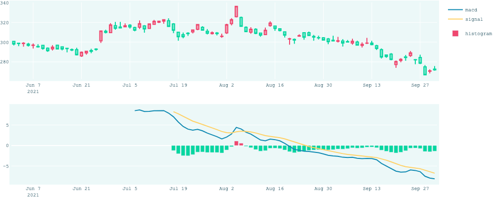

# Automated Single Stock Trading based on DRL

<!-- TABLE OF CONTENTS -->
<details>
  <summary>Table of Contents</summary>
  <ol>
    <li> <a href="#About this repository">About this repository</a>
    <li> <a href="#Set up environment">Set up environment</a>
    </li>
    <li>
      <a href="#usage">Usage</a>
      <ul>
        <li><a href="#Technical Indicator Analysis">Technical Indicator Analysis</a></li>
        <li><a href="#DRL Automated Trading">DRL Automated Trading</a></li>
      </ul>
    </li>
    <li><a href="#contact">Contact</a></li>
  </ol>
</details>

<!-- ABOUT THE PROJECT -->
## About this repository
This repository contains all required files for chapter 7 of my master thesis. It contains two parts: [Technical_Indicator_analysis](https://github.com/JingZhang918/master_thesis/tree/main/Technical_Indicator_Analysis) 
and [DRL_Automated_Trading](https://github.com/JingZhang918/master_thesis/tree/main/DRL_Automated_Trading) 

<!-- 
Abstract from my master thesis:
>In recent years, with the development of technology, the application of deep reinforcement learning has been gradually penetrating every aspect of our life. In this paper, I propose a methodology to deploy the RL framework into fiance. Start with explaining a series of basic concepts, basic RL framework, Markov Decision Process, Bellman Equation, etc., and algorithms to solve RL problems, such as Monte Carlo Control, Temporal Difference Control, Monte Carlo Gradient Policy(REINFORCE), and Proximal Policy Optimization(PPO). Later, seven commonly adopted technical analysis indicators — Moving Average Convergence Divergence(MACD), Relative Strength Index(RSI), Stochastic Oscillator, etc. — are explored, and their profitability is exploited. Finally, by learning from these technical indicators, my trained agent can make lucrative decisions on automated stock trading. -->

<p align="right">(<a href="#top">back to top</a>)</p>

<!-- Set up environment -->
## Set up environment
I **highly** recommend install [Ray](https://www.ray.io/) by the following commands, speaking from my experience, ray is 
relatively unstable. I have read many posts and encountered many problems, and this is the one that works.
```angular2html
conda create -n rllib_test python=3.7
conda activate rllib_test
pip install ray[rllib]
# clone ray repository
git clone https://github.com/ray-project/ray.git
cd ray
pip install -r python/requirements/ml/requirements_rllib.txt
```
Then install the other packages by
```angular2html
pip install yfinance pandas_ta plotly bayesian-optimization openpyxl -U kaleido
```
Then you should be fine :D
<p align="right">(<a href="#top">back to top</a>)</p>


<!-- usage -->
## Usage
<!-- Technical Indicator Analysis -->
### Technical Indicator Analysis
The main function of [Technical_Indicator_analysis](https://github.com/JingZhang918/master_thesis/tree/main/Technical_Indicator_Analysis) 
is to calculate, visualize the indicator and use the trading signal emitted by the indicator to trade and evaluate its profitability.
Currently supported indicators include:
 - Moving Average Convergence Divergence (MACD) (period: 12, 26, 9)
 - Relative Strength Indicator (RSI) (threshold: 30/70)
 - Stochastic Oscillator (threshold: 20/80)
 - Average Directional Index (ADX) (period: 14, strength threshold: 25)
 - Aroon Oscillator (period: 25)
For more information about these indicators, check out my blog [here](https://jingzhang.tech/index.php/blog/).
In the terminal run:
```angular2html
python run.py
```
will output the indicator visualization of Adidas Group (ticker: "ADS.DE"), the detailed trading records (under directory trading_records) of each indicator for each stock, the trading signal visualization , and their monthly and yearly return comparison with [iShares Core DAX UCITS ETF (DE)](https://www.justetf.com/en/etf-profile.html?isin=DE0005933931#exposure)


Description of iShares Core DAX UCITS ETF (DE): The iShares Core DAX UCITS ETF (DE) invests in stocks with focus Germany. The dividends in the fund are reinvested (accumulating). The total expense ratio amounts to 0.16% p.a.. The fund replicates the performance of the underlying index by buying all the index constituents (full replication). The iShares Core DAX UCITS ETF (DE) is a very large ETF with 6,937m Euro assets under management. The ETF is older than 5 years and is domiciled in Germany.

To add more indicators, you need to modify two functions:
```angular2html
get_data       from data_process.py
plot_indicator from visualization.py
```

####Future Improvements:
- get rid of config.pre_start_date input
- add longer comparison period such as 5 years
- add more technical indicators, such as Percentage Price Oscillator(PPO), Parabolic SAR, Standard Deviation, Bollinger Bands
Fibonacci Retracement, Williams Percent Range, Commodity Channel Index, Ichimoku Cloud
- Deploy and deliver the application to my website, so the user can enter a technical indicator and obtain its profitability
, and the corresponding trading strategy.  

<p align="right">(<a href="#top">back to top</a>)</p>


<!-- DRL Automated Trading -->
### DRL Automated Trading

The main functions of [DRL_Automated_Trading](https://github.com/JingZhang918/master_thesis/tree/main/DRL_Automated_Trading) 
is to train a PPO agent to discover lucrative trading signals for the user.

In the terminal run:
```angular2html
python run.py
```
will output the detailed training records for every stock every day, the visualization of yearly asset and reward comparison
with ETF return, and the visualization of monthly asset and reward comparison with ETF.


####Problems I encountered while using Ray
- Environment set up. I use M1 apple silicon and the official release doesn't work. => ✅ solution is provided above.
- The result reproducibility => ✅ wrote the solution in my blog [here](https://jingzhang.tech/index.php/2021/11/20/tutorial-for-drl-hyperparameter-tuning-in-a-custom-environment/)
- Custom environment does not take large parameter. For example, if I use 7 years of data to train the agent, it worked. Yet when
I take 8 years data, it shows no parameter is passed into the environment data error. => ❌ workaround solution: did a little work-around, 
changed the logic from using the accumulating data to train the model to using the latest 5 years
- List saving list into Excel(.xlsx). The terminal output and the saved file does not match. Yet the final answer is correct.
=> ❌  workaround solution: instead of saving ```list```, save ```np.sum(list)```
- Parameter assignment problem. Assign the parameter with ```trading_outlay = config.TRADING_OUTLAY```, where ```config.TRADING_OUTLAY = []```
does not work =>  ❌ workaround solution: ```trading_outlay = []``` works.
- No budget for GPU, so the training hour is really long. Every stock needs to be trained for 5 times and there are 30 stocks in
total. => ❌ No hyper-parameter tuning yet.

**IMPORTANT**: I highly recommend checking every output entry while using Ray. You never know what illogic error might happen.
You might say why not just change to another DRL library [Stable Baseline3](https://github.com/DLR-RM/stable-baselines3). 
SB3 does not support custom environment hyper-parameter tuning. Well there is another workaround, to build everything from
rock bottom on Pytorch. That is really time-consuming. 


####Future Improvements:
##### Improvements regarding project
- Pass some parameters through terminal, prepare for online deployment
- The visualization of DRL is severely subjected to two manually input parameters. In the future, it would be improved to no input at all.
- There is no saving model and reading model function yet. Due to the lengthy training time, hours or tens of hours or days depending on the tuning parameters, these two functions are of vital.

##### Improvements regarding single stock trading model
- Do hyper-parameter tuning. Keep refining the automated single stock trading model.
- Incorporate material and immaterial release. Cooperation release is an essential factor of stock price change.
- Add more technical indicators. Involve more, for instance, Percentage Price Oscillator(PPO), Parabolic SAR, Standard Deviation,
Bollinger Bands, Fibonacci Retracement, Williams Percent Range, Commodity Channel Index, Ichimoku Cloud, etc.
- Use CNN to recognize trading patterns such as (inverse) hammer, bullish engulfing, etc.
- Consider dividends for long-term trading. The dividend is an important part of income. The expectation of a future dividend affects the current stock price.
- Involve fundamentals, such as P/E, P/C, and so on. How well a company operates determines how worth its stock.
- Add material news that might affect the whole industry.
- Experienced traders' comments should be taken into consideration.
- Do sentiment analysis on financial statements and material information through NLP.
- Apply sentiment analysis also on stock commentators' articles, as well as sector-related news.
- Consider dividends for long-term trading. The dividend is an essential part of income. The expectation of a future dividend affects the current stock price. 
- pair the trading stock with another or several other stocks. Set up an automated multi-stock trading model. Multi-stocks from different sectors or industries could positively affect the agent—for example, pair trading. Pair trading happens to two stocks, usually with one stock rise and another with several lag days. Or with one stock rise and the other stock goes down. 
<p align="right">(<a href="#top">back to top</a>)</p>


<!-- Contact -->
## Contact

Any ideas you want to share with me, send me an email: jingzhang6057@gmail.com :smiley::smiley:

<p align="right">(<a href="#top">back to top</a>)</p>


